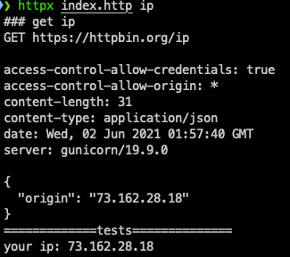

httpx: CLI for http file
==============================

http file used by JetBrains IDE and VS Code REST Client for editor http client, and httpx is CLI to execute the http request in http file.

# Features

* Execute requests in http file
* Javascript validation support: ECMAScript 5.1 by JetBrains,  esnext support by httpx

# Get started

### Install httpx

```
deno install -q --location https://denopkg.com//linux-china/deno-httpx --allow-net --allow-read --allow-env --unstable -r -f -n httpx https://denopkg.com/linux-china/deno-httpx/cli.ts
```

### index.http file

Create 'index.http' file with following code:

```
### getInternetIp
GET https://httpbin.org/ip

> 
```

### Execute http target

Execute `httpx index.http getInternetIp` on the terminal.

**Attention**: getInternetIp is a keyword, and httpx will search first keyword that appears in comment and url.



# References

* HTTP Request in Editor Specification: https://github.com/JetBrains/http-request-in-editor-spec/blob/master/spec.md
* HTTP client in IntelliJ IDEA code editor: https://www.jetbrains.com/help/idea/http-client-in-product-code-editor.html
* VS Code REST Client extension: https://marketplace.visualstudio.com/items?itemName=humao.rest-client
